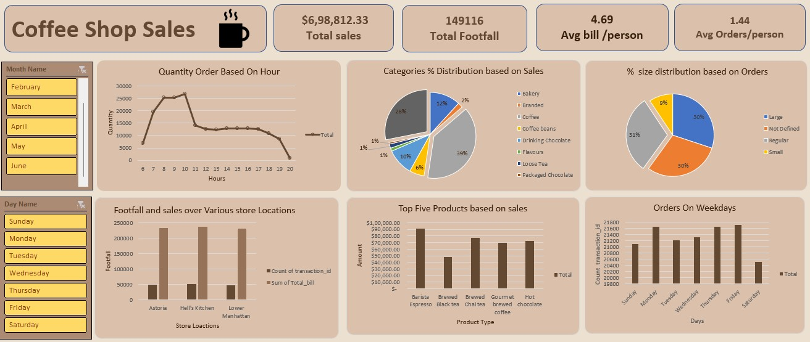

#  Coffee Shop Sales Analysis

_Data-driven analysis of coffee shop sales using Excel to uncover trends, optimize operations, and support business decisions._

---

## 📌 Table of Contents
- <a href="#overview">Overview</a>
- <a href="#business-problem">Business Problem</a>
- <a href="#dataset">Dataset</a>
- <a href="#tools--technologies">Tools & Technologies</a>
- <a href="#project-structure">Project Structure</a>
- <a href="#research-questions--key-findings"> Key Findings</a>
- <a href="#author--contact">Author & Contact</a>

---
<h2><a class="anchor" id="overview"></a>Overview</h2>

This project analyzes sales performance data from a coffee shop chain and presents insights through an interactive Excel dashboard. The goal was to identify product performance, customer behavior, and store-level trends to support data-driven decision-making.

---
<h2><a class="anchor" id="business-problem"></a>Business Problem</h2>

Sales & Performance :
The management of a coffee shop chain wanted to understand sales
performance across different products, categories, and store locations
to identify top contributors and growth opportunities.


---
<h2><a class="anchor" id="dataset"></a>Dataset</h2>

- The dataset used for this project contains coffee shop sales transactions.
- The dataset you can download from Kaggle.

---

<h2><a class="anchor" id="tools--technologies"></a>Tools & Technologies</h2>

- Excel:
   - Pivot tables for summarizing data
   - Charts & slicers for interactivity
   - Dashboard design and formatting
-  Power Query (within Excel):
   - importing and transforming data
   - Data cleaning & preparation

---
<h2><a class="anchor" id="project-structure"></a>Project Structure</h2>

```
Coffee_Sales_project/
┣ 📜.gitignore
┣ 📜coffe_sales_project.xlsx
┣ 📜Data_set.xlsx
┣ 📜README.MD
┗ 📜Screenshot .jpg

```


---
<h2><a class="anchor" id="research-questions--key-findings"></a> Key Findings</h2>

1. **Total Sales:** $6,98,812.33
2. **Total Footfall:** 149,116 customers
3. **Top 5 Products:**
    -  Barista Espresso
    -  Brewed Black Tea
    -  Brewed Chai Tea
    -  Hot Chocolate
    -  Gourmet Brewed Coffee

4. **Order Size Trend:** 'Regular' size is the most popular order size.

---

<h2><a class="anchor" id="dashboard"></a>Dashboard</h2>

- Excel Dashboard shows:
  - Categories percentage distribution based on sales
  - Top five products based on sales
  - Footfall and Sales over various store Locations



---

<h2><a class="anchor" id="author--contact"></a>Author & Contact</h2>

**Sumit Bhagat**  
Aspiring Data Analyst  
📧 Email: sumitbhagat066@gmail.com  
🔗 [LinkedIn](https://www.linkedin.com/in/sumit-bhagat-84926234b/)  
🔗 [Github](https://github.com/sumitbhagat1x)
